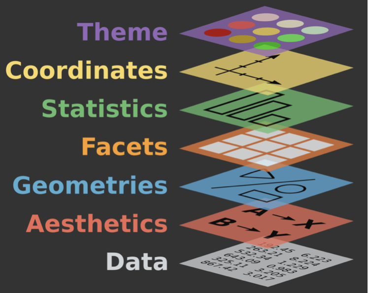

```{r setup, include = FALSE, cache = FALSE}
# generate CSS file
library(xaringanthemer)
rcfss::xaringan_theme()

# source in the default knitr options
source(here::here("R", "slide-opts.R"))
knitr::opts_chunk$set(fig.align = "default")

# enable panelsets and default theme
xaringanExtra::use_panelset()
ggplot2::theme_set(ggplot2::theme_minimal(base_size = 16))

# load basic packages
library(knitr)
library(here)
library(countdown)
library(patchwork)
```

class: middle, inverse

# Welcome

---

## Agenda for today

- Coordinate systems

- Facets

- Group collaboration

---

## Setup

.small[
```{r message = FALSE, cache = FALSE}
# load packages
library(tidyverse)
library(knitr)
library(openintro)
library(palmerpenguins)
library(ggrepel)
library(waffle)
library(broom)

# set default theme for ggplot2
ggplot2::theme_set(ggplot2::theme_minimal(base_size = 16))

# set default figure parameters for knitr
knitr::opts_chunk$set(
  fig.width = 8, fig.asp = 0.618, fig.retina = 2,
  dpi = 150, out.width = "60%"
)

# dplyr print min and max
options(dplyr.print_max = 6, dplyr.print_min = 6)
```
]

---

class: middle, inverse

# Coordinate systems

---

## Coordinate systems: purpose

- Combine the two position aesthetics (`x` and `y`) to produce a 2d position on the plot:
  - linear coordinate system: horizontal and vertical coordinates 
  - polar coordinate system: angle and radius
  - maps: latitude and longitude

- Draw axes and panel backgrounds in coordination with the faceter coordinate systems

---

## Coordinate systems: types

1. **Linear coordinate systems:** preserve the shape of geoms

  - `coord_cartesian()`: the default Cartesian coordinate system, where the 2d position of an element is given by the combination of the x and y positions.
  - `coord_flip()`: Cartesian coordinate system with x and y axes flipped *(won't be using much now that geoms can take aesthetic mappings in x and y axes)*
  - `coord_fixed()`: Cartesian coordinate system with a fixed aspect ratio. *(useful only in limited circumstances)*

--
2. **Non-linear coordinate systems:** can change the shapes -- a straight line may no longer be straight. The closest distance between two points may no longer be a straight line.

  - `coord_trans()`: Apply arbitrary transformations to x and y positions, after the data has been processed by the stat
  - `coord_polar()`: Polar coordinates
  - `coord_map()` / `coord_quickmap()` / `coord_sf()`: Map projections

---

## Setting limits: what the plots say

.tiny[
```{r set-limits, out.width = "25%", fig.width = 6, fig.show = "hold", warning = FALSE, message = FALSE}
ggplot(penguins, aes(x = flipper_length_mm, y = body_mass_g, color = species)) +
  geom_point() + geom_smooth() +
  labs(title = "Plot 1")

ggplot(penguins, aes(x = flipper_length_mm, y = body_mass_g, color = species)) +
  geom_point() + geom_smooth() +
  scale_x_continuous(limits = c(190, 220)) + scale_y_continuous(limits = c(4000, 5000)) + #<<
  labs(title = "Plot 2")

ggplot(penguins, aes(x = flipper_length_mm, y = body_mass_g, color = species)) +
  geom_point() + geom_smooth() +
  xlim(190, 220) + ylim(4000, 5000) + #<<
  labs(title = "Plot 3")

ggplot(penguins, aes(x = flipper_length_mm, y = body_mass_g, color = species)) +
  geom_point() + geom_smooth() +
  coord_cartesian(xlim = c(190,220), ylim = c(4000, 5000)) + #<<
  labs(title = "Plot 4")
```
]

---

## Setting limits: what the warnings say

.tiny[
```{r ref.label = "set-limits", fig.show = "hide", message = FALSE, warning = TRUE, collapse = TRUE}
```
]

---

## Setting limits

- Setting scale limits: Any data outside the limits is thrown away
  - `scale_*_continuous()`, `xlim` and `ylim` arguments
  - `xlim()` and `ylim()`

- Setting coordinate system limits: Use all the data, but only display a small region of the plot (zooming in)
  - `coord_cartesian()`, `xlim` and `ylim` arguments

---

## Fixing aspect ratio with `coord_fixed()`

Useful when having an aspect ratio of 1 makes sense, e.g. scores on two tests (reading and writing) on the same scale (0 to 100 points)

.tiny[
```{r out.width = "40%", fig.show = "hold", message = FALSE}
ggplot(hsb2, aes(x = read, y = write)) +
  geom_point() + geom_smooth(method = "lm") +
  geom_abline(intercept = 0, slope = 1, linetype = "dashed", color = "gray") +
  labs(title = "Not fixed")

ggplot(hsb2, aes(x = read, y = write)) +
  geom_point() + geom_smooth(method = "lm") +
  geom_abline(intercept = 0, slope = 1, linetype = "dashed", color = "gray") +
  coord_fixed() + #<<
  labs(title = "Fixed")
```
]

---

## Transformations

.tiny[
```{r transformations, out.width = "25%", fig.width = 6, fig.show = "hold", warning = FALSE, message = FALSE}
ggplot(penguins, aes(x = bill_depth_mm, y = body_mass_g)) +
  geom_point() + geom_smooth(method = "lm") +
  labs(title = "Plot 1")

ggplot(penguins, aes(x = bill_depth_mm, y = body_mass_g)) +
  geom_point() + geom_smooth(method = "lm") +
  scale_x_log10() + scale_y_log10() + #<<
  labs(title = "Plot 2")

ggplot(penguins, aes(x = bill_depth_mm, y = body_mass_g)) +
  geom_point() + geom_smooth(method = "lm") +
  coord_trans(x = "log10", y = "log10") + #<<
  labs(title = "Plot 3")

ggplot(penguins, aes(x = log(bill_depth_mm, base = 10), y = log(body_mass_g, base = 10))) + #<<
  geom_point() + geom_smooth(method = "lm") +
  labs(title = "Plot 4")
```
]

---

## Pie charts and bullseye charts with `coord_polar()`

.small[
```{r out.width = "30%", fig.show = "hold", warning = FALSE, message = FALSE}
ggplot(penguins, aes(x = 1, fill = species)) +
  geom_bar() +
  labs(title = "Stacked bar chart")

ggplot(penguins, aes(x = 1, fill = species)) +
  geom_bar() +
  coord_polar(theta = "y") + #<<
  labs(title = "Pie chart")

ggplot(penguins, aes(x = 1, fill = species)) +
  geom_bar() +
  coord_polar(theta = "x") +
  labs(title = "Bullseye chart") #<<
```
]

---

class: middle

.large[.hand[aside: about pie charts...]]

---

## Pie charts

.task[
What do you know about pie charts and data visualization best practices? Love 'em or lose 'em?
]

```{r echo = FALSE, out.width = "45%"}
loans <- loans_full_schema %>%
  mutate(application_type = as.character(application_type)) %>%
  filter(application_type != "") %>%
  mutate(
    homeownership    = tolower(homeownership), 
    homeownership    = fct_relevel(homeownership, "rent", "mortgage", "own"), 
    application_type = fct_relevel(application_type, "joint", "individual")
    ) 

pie_homeownership <- loans %>% 
  mutate(homeownership = fct_infreq(homeownership)) %>%
  count(homeownership) %>%
  mutate(text_y = cumsum(n) - n/2) %>%
  ggplot(aes(x = "", fill = homeownership, y = n)) + 
  geom_col(position = position_stack(reverse = TRUE), show.legend = FALSE) +
  geom_text_repel(aes(x = 1, label = homeownership, y = text_y)) +
  coord_polar("y", start = 0) +
  scale_fill_openintro("hot") +
  theme_void(base_size = 16) +
  labs(title = "Homeownership")
pie_homeownership

pie_loan_grades <- loans %>% 
  count(grade) %>% 
  mutate(text_y = cumsum(n) - n/2) %>% 
  ggplot(aes(x = "", fill = grade, y = n)) + 
  geom_col(position = position_stack(reverse = TRUE), show.legend = FALSE) +
  geom_text_repel(aes(x = 1.4, label = grade, y = text_y), nudge_x = 0.3, segment.size = 0.5) + 
  coord_polar(theta = "y") + 
  scale_fill_openintro("cool") +
  theme_void(base_size = 16) +
  labs(title = "Loan grade")
pie_loan_grades
```

---

## Pie charts: when to love 'em, when to lose 'em

.pull-left-narrow[
`r emo::ji("heart")` For categorical variables with few levels, bar charts can work well
]
.pull-right-wide[
```{r echo = FALSE, out.width = "50%"}
pie_homeownership

loans %>%
  ggplot(aes(x = homeownership, fill = homeownership)) +
  geom_bar(show.legend = FALSE) +
  scale_fill_openintro("hot") +
  labs(x = "Homeownership", y = "Count")
```
]

.pull-left-narrow[
`r emo::ji("broken_heart")` For categorical variables with many levels, bar charts are difficult to read
]
.pull-right-wide[
```{r echo = FALSE, out.width = "50%"}
pie_loan_grades

loans %>%
  ggplot(aes(x = grade, fill = grade)) +
  geom_bar(show.legend = FALSE) +
  scale_fill_openintro("cool") +
  labs(x = "Loan grade", y = "Count")
```
]

---

## Waffle charts

- Like with pie charts, work best when the number of levels represented is low
- Unlike pie charts, easier to compare proportions that represent non-simple fractions

```{r out.width = "50%",  fig.asp = 0.5, fig.show = "hold", echo = FALSE}
loans %>%
  count(homeownership) %>%
  ggplot(aes(fill = homeownership, values = n)) +
  geom_waffle(color = "white", flip = TRUE, make_proportional = TRUE) +
  labs(fill = NULL, title = "Homeownership") +
  scale_fill_openintro("hot") +
  coord_equal() +
  theme_enhance_waffle() +
  theme(legend.position = "bottom")

loans %>%
  count(loan_status) %>%
  ggplot(aes(fill = loan_status, values = n)) +
  geom_waffle(color = "white", flip = TRUE, make_proportional = TRUE)  +
  labs(fill = NULL, title = "Loan status") +
  scale_fill_openintro("four") +
  coord_equal() +
  theme_enhance_waffle() +
  theme(legend.position = "bottom") +
  guides(fill=guide_legend(nrow = 2))
```

---

## Waffle charts: making of

.panelset[
.panel[.panel-name[Code]
```{r ref.label = "waffle-penguin", echo = TRUE, fig.show = "hide"}
```
]
.panel[.panel-name[Plot]
```{r waffle-penguin, echo = FALSE}
penguins %>%
  count(species) %>%
  ggplot(aes(fill = species, values = n)) +
  geom_waffle(color = "white", flip = TRUE, make_proportional = TRUE) + #<<
  labs(fill = NULL, title = "Penguin species")
```
]
]

---

## Waffle charts: enhanced theme

.panelset[
.panel[.panel-name[Code]
```{r ref.label = "waffle-penguin-theme", echo = TRUE, fig.show = "hide"}
```
]
.panel[.panel-name[Plot]
```{r waffle-penguin-theme, echo = FALSE}
penguins %>%
  count(species) %>%
  ggplot(aes(fill = species, values = n)) +
  geom_waffle(color = "white", flip = TRUE, make_proportional = TRUE) +
  labs(fill = NULL, title = "Penguin species") +
  theme_enhance_waffle() #<<
```
]
]

---

class: middle

.large[.hand[back to coordinate systems...]]

---

## `coord_quickmap()`

.pull-left-narrow[
- Approximation that sets the aspect ratio to ensure that 1m of latitude and 1m of longitude are the same distance in the middle of the plot
- Reasonable for smaller regions
- Fast
]
.pull-right-wide[
.panelset[
.panel[.panel-name[Cartesian]
```{r out.width = "75%"}
ggplot(map_data("italy"), aes(long, lat, group = group)) +
  geom_polygon(fill = "white", color = "#008c45") +
  labs(x = NULL, y = NULL)
```
]
.panel[.panel-name[Quickmap]
```{r out.width = "75%"}
ggplot(map_data("italy"), aes(long, lat, group = group)) +
  geom_polygon(fill = "white", color = "#008c45") +
  labs(x = NULL, y = NULL) +
  coord_quickmap()
```
]
]
]

---

## `coord_map()`

.pull-left-narrow[
- Uses the [**mapproj**](https://cran.r-project.org/package=mapproj) package
- Uses [Mercator projection](https://en.wikipedia.org/wiki/Mercator_projection) by default, with many other options via  `mapproj::mapproject() `
- Slower than `coord_quickmap()`
]
.pull-right-wide[
.panelset[
.panel[.panel-name[Cartesian]
```{r out.width = "75%"}
ggplot(map_data("state"), aes(long, lat, group = group)) +
  geom_polygon(fill = "white", color = "#3c3b6e") +
  labs(x = NULL, y = NULL)
```
]
.panel[.panel-name[Mercator]
```{r out.width = "75%"}
ggplot(map_data("state"), aes(long, lat, group = group)) +
  geom_polygon(fill = "white", color = "#3c3b6e") +
  labs(x = NULL, y = NULL) +
  coord_map()
```
]
.panel[.panel-name[Stereographic]
```{r out.width = "75%"}
ggplot(map_data("state"), aes(long, lat, group = group)) +
  geom_polygon(fill = "white", color = "#3c3b6e") +
  labs(x = NULL, y = NULL) +
  coord_map(projection = "stereographic")
```
]
]
]

---

class: middle, inverse

# Facets

---

## `facet_*()`

.pull-left[
- `facet_wrap()` 
  - "wraps" a 1d ribbon of panels into 2d
  - generally for faceting by a single variable
- `facet_grid()` for faceting 
  - produces a 2d grid of panels defined by variables which form the rows and columns
  - generally for faceting by two variables
- `facet_null()`: a single plot, the default
]
.pull-right[
```{r echo = FALSE}

```
]

---

## Free the scales!

.small[
```{r free-all-scales, out.width = "50%", fig.asp = 0.5, fig.width = 8, fig.show = "hold", warning = FALSE, message = FALSE}
p <- ggplot(penguins, aes(x = flipper_length_mm, y = body_mass_g)) +
  geom_point()

p + 
  facet_wrap(vars(species)) + 
  labs(title = "Same scales")
p + 
  facet_wrap(vars(species), scales = "free") +
  labs(title = "Free scales")
```
]

---

## Free some scales

.small[
```{r free-some-scales, out.width = "50%", fig.asp = 0.5, fig.width = 8, fig.show = "hold", warning = FALSE, message = FALSE}
p +
  facet_wrap(vars(species), scales = "free_x") +
  labs(title = "Free x scale")
p +
  facet_wrap(vars(species), scales = "free_y") +
  labs(title = "Free x scale")
```
]

---

.task[
Freeing the y scale improves the display, but it's still not satisfying. What's wrong with it?
]

.small[
```{r free-scales-not-spaces, out.width = "50%", fig.asp = 0.5, fig.width = 8, fig.show = "hold", warning = FALSE, message = FALSE}
ggplot(penguins, aes(y = species, x = body_mass_g, fill = species)) +
  geom_boxplot(show.legend = FALSE) +
  facet_grid(island ~ .) +
  labs(title = "Same scale and spacing")

ggplot(penguins, aes(y = species, x = body_mass_g, fill = species)) +
  geom_boxplot(show.legend = FALSE) +
  facet_grid(island ~ ., scales = "free_y") +
  labs(title = "Free y scale, same spacing")
```
]

---

## Free spaces

```{r free-spaces, warning = FALSE, message = FALSE}
ggplot(penguins, aes(y = species, x = body_mass_g, fill = species)) +
  geom_boxplot(show.legend = FALSE) +
  facet_grid(island ~ ., scales = "free_y", space = "free") +
  labs(title = "Free y scale and spacing")
```

---

## Highlighting across facets

```{r warning = FALSE, out.width = "50%"}
penguins_sans_species <- penguins %>% select(-species)

ggplot(penguins, aes(x = flipper_length_mm, y = body_mass_g)) +
  geom_point(data = penguins_sans_species, color = "gray") +
  geom_point(aes(color = species)) +
  facet_wrap(vars(species))
```

---

class: middle, inverse

# Project #1

---

# Project #1

.pull-left[
- Initial proposal
- Develop as a group
- Take chances, make mistakes, get messy!
]

--

.pull-right[
```{r echo = FALSE}
include_graphics(path = "https://media.giphy.com/media/vhpwk2TOw2hq0/giphy.gif")
```
]
